<h1>Lecture 1: Introduction and Peak Finding</h1>

<h2>Peak Finder</h2>

<h3>One-dimensional Version</h3>

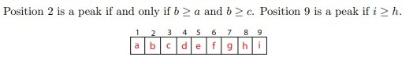

__Straightforward Algorithm__

The straightforward algorithm is where you iterate through all the numbers and find the peak, that takes O(n) time. A better way would be to use the divide and conquer approach.

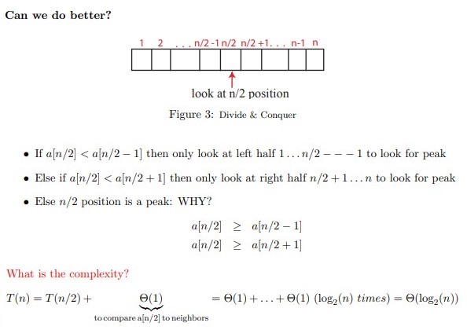

<h3>Two-dimensional Version</h3>

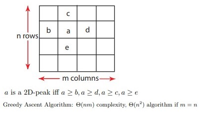

__Attempt # 1: Extend 1D Divide and Conquer to 2D__

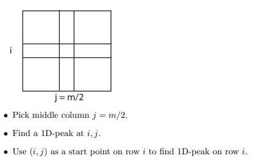

Attempt #1 fails because the 2D-peak may not exist on row i.

__Attempt # 2__

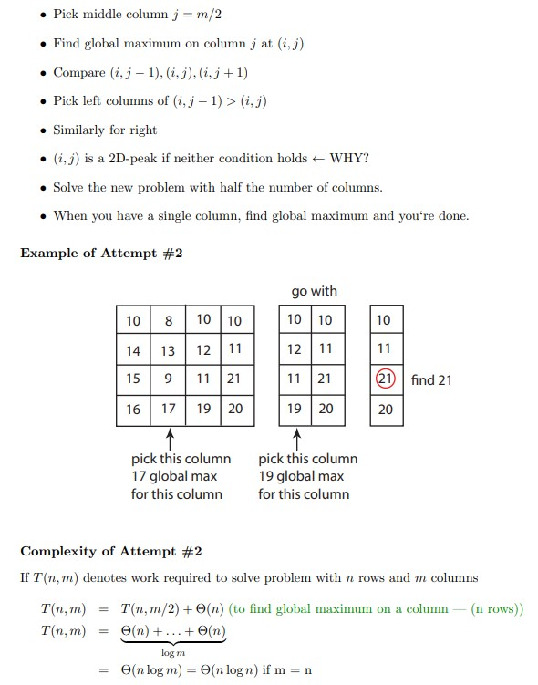

<h1>Readings</h1>

<h2>Chapter 1: The Role of Algorithms in Computing</h2>

<h3>Algorithms</h3>

- Informally, an algorithm is any well-defined computational procedure that takes some value, or set of values, as input and produces some value, or set of values, as output. An algorithm is thus a sequence of computational steps that transform the input into the output.

- An _instance of a problem_ consists of the input (satisfying whatever constraints are imposed in the problem statement) needed to compute a solution to the problem.

- Although no efficient algorithm for an NP-complete problem has ever been found, nobody has ever proven that an efficient algorithm for one cannot exist. In other words, no one knows
whether or not efficient algorithms exist for NP-complete problems. Second, the
set of NP-complete problems has the remarkable property that if an efficient algorithm exists for any one of them, then efficient algorithms exist for all of them.

<h2>Chapter 3: Growth of Functions</h2>

When we look at input sizes large enough to make only the order of growth of the running time relevant, we are studying the _asymptotic_ efficiency of algorithms.

<h3>Asymptotic notation</h3>

The notations we use to describe the asymptotic running time of an algorithm are defined in terms of functions whose domains are the set of natural numbers (0, 1, 2, ...). Such notations are convenient for describing the worst-case running-time function T(n), which usually is defined only on integer input sizes.

In this book, the functions to which we apply asymptotic notation will usually characterize the running times of algorithms. But asymptotic notation can apply to functions that characterize some other aspect of algorithms (the amount of space they use, for example), or even to functions that have nothing whatsoever to do with algorithms.

__$\Theta$-notation__

The worst-case running time of insertion sort is $T(n) = \Theta (n^2)$. Let us define what this notation means. For a given function g(n) we denote by $\Theta (g(n))$ the set of functions:

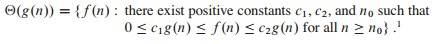

For all $n \geq n_0$, the function f(n) is equal to g(n) to within a constant factor. We say that g(n) is an _asymptotically tight bound_ for f(n).

The definition of $Θ(g(n))$ requires that every member $f(n)=Θ(g(n))$ be _asymptotically nonnegative_, that is, that f(n) be nonnegative whenever n is sufficiently large.

__*O*-notation__

When we have only an _asymptotic upper bound_, we use *O*-notation.

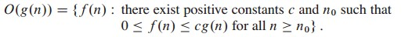

*O*-notation is a subset of $\Theta$-notation.

Since *O*-notation is bound on the worst case running time, we can say that as the run time of every input, whereas the $\Theta$-notation doesn't imply on _every_ input.

__$\Omega$-notation__

Just as _O_-notation provides an asymptotic upper bound on a function, $\Omega$-notation provides an _asymptotic lower bound_.

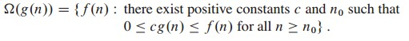

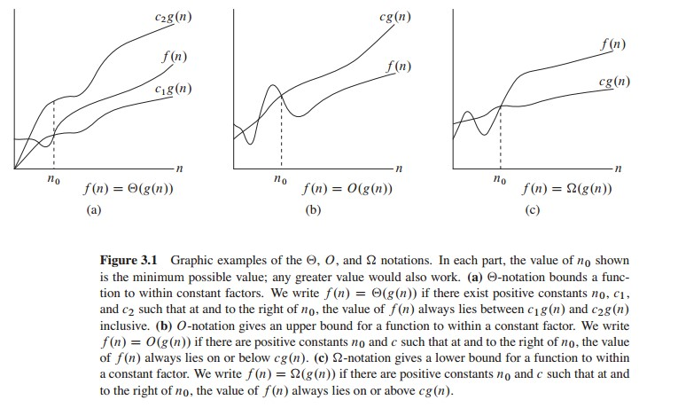

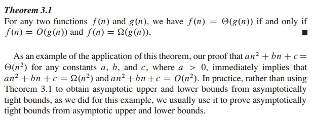

When we say that the running time (no modifier) of an algorithm is $\Omega(g(n))$, we mean that _no matter what particular input of size n is chosen for each value of n_, the running time on that input is at least a constant times g(n), for sufficiently large n. Equivalently, we are giving a lower bound on the best-case running time of an algorithm.

__Asymptotic notation in equations and inequalities__

In general, however, when asymptotic notation appears in a formula, we interpret it as standing for some anonymous function that we do not care to name. For example, the formula $2n^2 + 3n + 1 = 2n^2 + \Theta(n)$ means that $2n^2 + 3n + 1 = 2n^2 + f(n)$, where f(n) is some function in the set $\Theta(n)$. In this case, we let $f(n) = 3n + 1$, which indeed is in $\Theta(n)$.

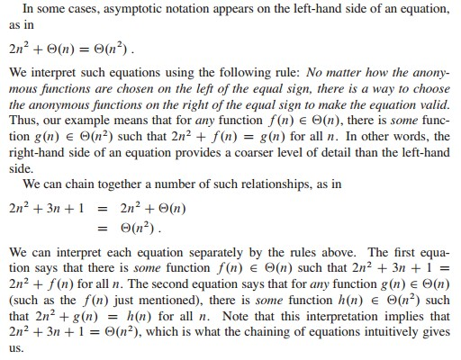

__*o*-notation__

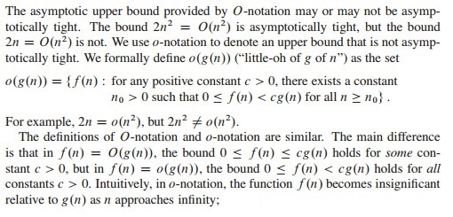

__$\omega$-notation__

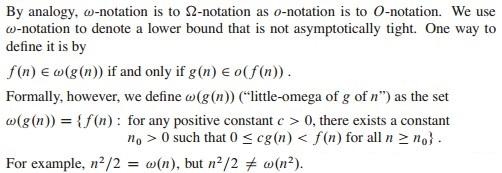

__Comparing functions__

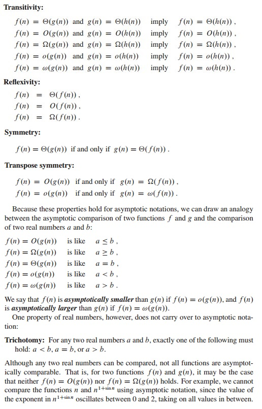

<h3>Standard notations and common functions</h3>

__Monotonicity__

A function f(n) is _monotonically increasing_ if $m \leq n$ implies $f(m) \leq f(n)$. Similarly, it is _monotonically decreasing_ if $m \leq n$ implies $f(m) \geq f(n)$. A function f(n) is _strictly increasing_ if m < n implies f(m) < f(n) and _strictly decreasing_ if m < n implies f(m) > f(n).

__Floors and ceilings__

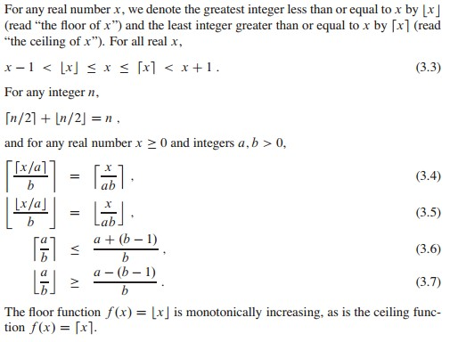

__Modular arithmetic__

For any integer a and any positive integer n, the value a mod n is the remainder (or residue) of the quotient a/n: a mod n = $a - n \lfloor a/n \rfloor$

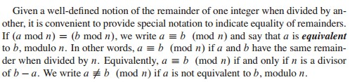

__Polynomials__

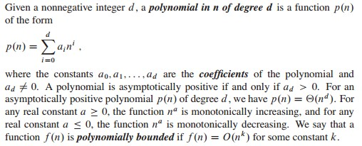

__Exponentials__

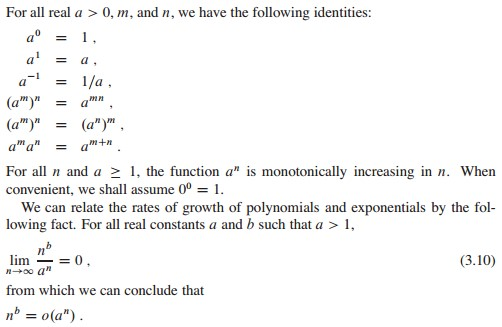

_Thus, any exponential function with a base strictly greater than 1 grows faster than any polynomial function._

__Logarithms__

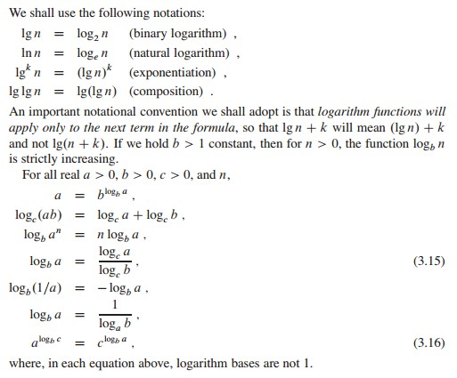

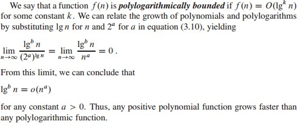

__Factorials__

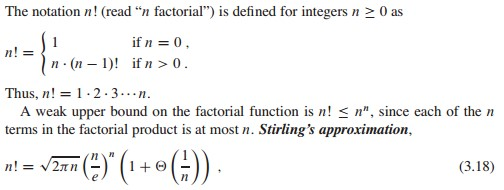

where e is the base of the natural logarithm, gives us a tighter upper bound, and a lower bound as well.

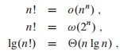

<h2>Chapter D.1: Matrices and matrix operations</h2>

The _transpose_ of a matrix A is the matrix AT obtained by exchanging the rows and columns of A.

We take the standard form of a vector to be as a _column vector_ equivalent to an $n \times 1$ matrix; the corresponding row vector is obtained by taking the transpose.

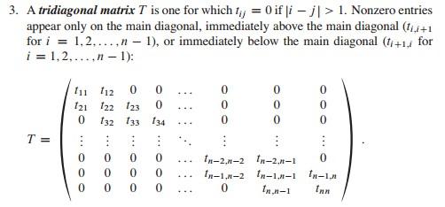

<h1>Lecture 2: Models of Computation, Document Distance</h1>

<h2>Python Cost Model</h2>

__Python Running Time Experiments and Discussion__

The running times for various-sized inputs were measured, and then a least-squares fit was used to find the coefficient for the high-order term in the running time. (Which term is high-order was determined by some experimentation; it could have been automated...)

The least-squares fit was designed to minimize the sum of squares of relative error, using scipy.optimize.leastsq.

(Earlier version of this program worked with more than the high-order term; they also found coefficients for lower-order terms. But the interpolation routines tended to be poor at distinguishing n and n lg n. Also, it was judged to be more interesting to work with relative error than with absolute error. Finally, it seemed that looking at only the high-order term, and studying only the relative error, seemed simplest.)

The machine used was an IBM Thinkpad T43p with a 1.86GHz Pentium M processor and 1.5GB RAM.

The timing code is inside the [codes folder](../codes/timing.py).

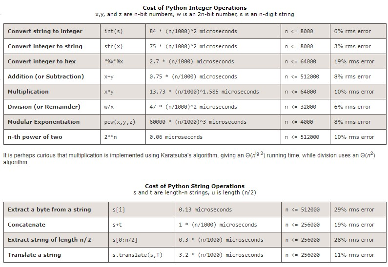

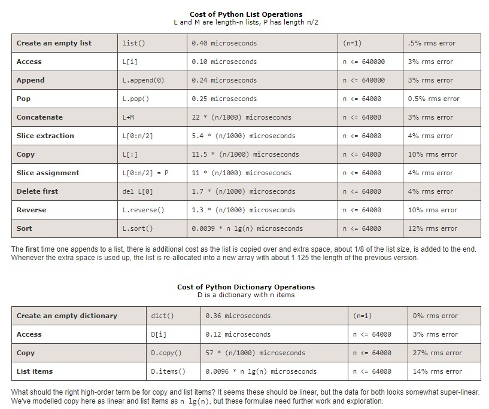
