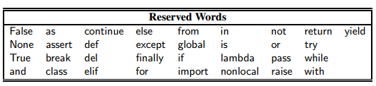
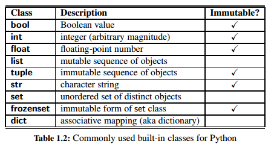
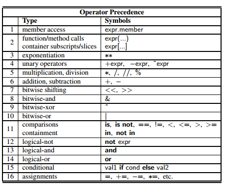
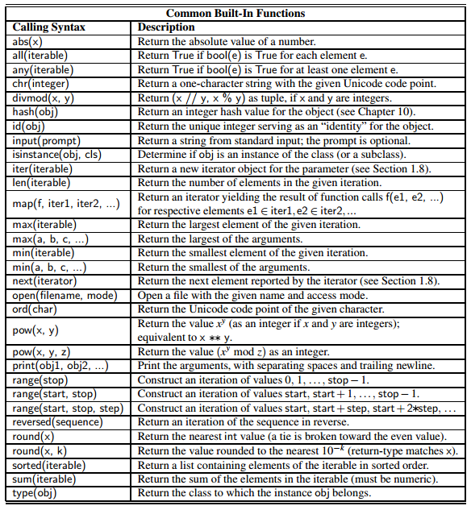
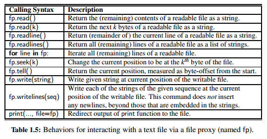
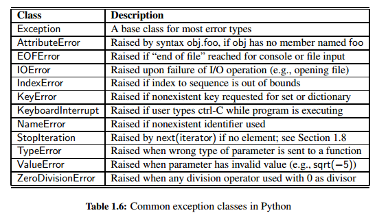
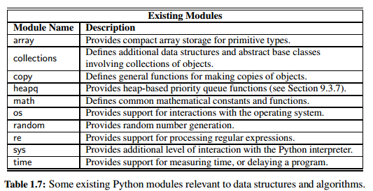

<h1>Python Primer</h1>


<h2>Python Overview</h2>


<h3>The Python Interpreter</h3>

Python is formally an _interpreted_ language. Commands are executed through a piece of software known as the _Python interpreter_.


<h2>Objects in Python</h2>


Python is an object-oriented language and classes form the basis for all data types.


<h3>Identifiers, Objects, and the Assignment Statement</h3>

The most important of all Python commands is an _assignment statement_, such as `temperature = 98.6`. This command establishes temperature as an identifier (also known as a _name_), and then associates it with the _object_ expressed on the right-hand side of the equal sign, in this case a floating-point object with value 98.6. Identifiers in Python are case-sensitive.



Python identifier is most similar to a reference variable in Java or a pointer variable in C++. Each identifier is implicitly associated with the _memory address_ of the object to which it refers. A Python identifier may be assigned to a special object named None, serving a similar purpose to a null reference in Java or C++.

Unlike Java and C++, Python is a _dynamically typed_ language, as there is no advance declaration associating an identifier with a particular data type. An identifier can be associated with any type of object, and it can later be reassigned to another object of the same (or different) type.

A programmer can establish an _alias_ by assigning a second identifier to an existing object. For example, `original=temperature`. Once an alias has been established, either name can be used to access the underlying object. If that object supports behaviors that affect its state, changes enacted through one alias will be apparent when using the other alias (because they refer to the same object).

However, if one of the names is reassigned to a new value using a subsequent assignment statement, that does not affect the aliased object, rather it breaks the alias. For example: `temperature = temperature + 5.0` (temperature=103.6, original=98.6).

<h3>Creating and Using Objects</h3>

__Instantiation:__

The process of creating a new instance of a class is known as instantiation.  In general, the syntax for instantiating an object is to invoke the _constructor_ of a class. For example for a Widget class without parameters: `w = Widget()`.

Many of Python’s built-in classes support what is known as a _literal_ form for designating new instances. For example, the command temperature = 98.6 results in the creation of a new instance of the _float_ class; the term 98.6 in that expression is a literal form.

__Calling Methods:__

Python’s classes may also define one or more _methods_ (also known as _member functions_), which are invoked on a specific instance of a class using the dot (“.”) operator. When using a method of a class, it is important to understand its behavior. Some methods return information about the state of an object, but do not change that state. These are known as _accessors_. Other methods, such as the sort method of the list class, do change the state of an object. These methods are known as _mutators_ or _update methods_

<h3>Python’s Built-In Classes</h3>

A class is _immutable_ if each object of that class has a fixed value upon instantiation that cannot subsequently be changed.



The list, tuple, and str classes are sequence types in Python, representing a collection of values in which the order is significant.

A __list__ instance stores a sequence of objects. A list is a _referential_ structure, as it technically stores a sequence of _references_ to its elements.

Python’s __set__ class represents the mathematical notion of a set, namely a collection of elements, without duplicates, and without an inherent order to those elements. Only instances of immutable types can be added to a Python set. Therefore, objects such as integers, floating-point numbers,
and character strings are eligible to be elements of a set. It is possible to maintain a set of tuples, but not a set of lists or a set of sets, as lists and sets are mutable. The __frozenset__ class is an immutable form of the set type, so it is legal to have a set of frozensets.


<h2>Expressions, Operators, and Precedence</h2>


__Logical Operators:__

- _not_ unary negation
- _and_ conditional and
- _or_ conditional or

The _and_ and _or_ operators short-circuit, in that they do not evaluate the second operand if the result can be determined based on the value of the first operand.

__Equality Operators:__

- _is_ same identity
- _is not_ different identity
- == equivalent
- != not equivalent

The expression a is b evaluates to True, precisely when identifiers a and b are aliases for the same object. The expression a == b tests a more general notion of equivalence. If identifiers a and b refer to the same object, then a == b should also evaluate to True. Yet a == b also evaluates to True when the identifiers refer to different objects that happen to have values that are deemed equivalent.

__Comparison Operators:__

- `<` less than
- `<=` less than or equal to
- `>` greater than
- `>=` greater than or equal to

__Arithmetic Operators:__

- `+` addition
- `−` subtraction
- `*` multiplication
- `/` true division
- `//` integer division
- `%` the modulo operator

We note that languages such as C, C++, and Java do not support the // operator; instead, the / operator returns the truncated quotient when both operands have integral type, and the result of true division when at least one operand has a floating-point type.

$n$ and $m$ represent respectively the dividend and divisor of a quotient $n/m$ and that $q = n // m$ and $r = n % m$. Python guarantees that $q \times m + r = n$. So, this becomes confusing when you have negative n and m values, so make sure you calculate the equation above to validate your answer. For example, $−27 // 4$ evaluates to −7 and −27 % 4 evaluates to 1, as $(−7) \times 4+ 1 = −27$.

__Bitwise Operators:__

- `∼` bitwise complement (prefix unary operator)
- `&` bitwise and
- `|` bitwise or
- `ˆ` bitwise exclusive-or
- `<<` shift bits left, filling in with zeros
- `>>` shift bits right, filling in with sign bit

__Sequence Operators:__

Each of Python’s built-in sequence types (str, tuple, and list) support the following operator syntaxes:

- `s[j] ` element at index j
- `s[start:stop]` slice including indices [start,stop)
- `s[start:stop:step]` slice including indices start, start + step, start + 2 step, . . . , up to but not equalling or stop
- `s + t ` concatenation of sequences
- `k * s` shorthand for s + s + s + ... (k times)
- `val in s` containment check
- `val not in s` non-containment check

All sequences define comparison operations based on lexicographic order, performing an element by element comparison until the first difference is found. Therefore, the following operations are supported by sequence types:

- `s == t` equivalent (element by element)
- `s != t` not equivalent
- `s < t` lexicographically less than
- `s <= t` lexicographically less than or equal to
- `s > t` lexicographically greater than
- `s >= t` lexicographically greater than or equal to

__Operators for Sets and Dictionaries:__

Sets and frozensets support the following operators:

- `key in s` containment check
- `key not in s` non-containment check
- `s1 == s2` s1 is equivalent to s2
- `s1 != s2` s1 is not equivalent to s2
- `s1 <= s2` s1 is subset of s2
- `s1 < s2` s1 is proper subset of s2
- `s1 >= s2` s1 is superset of s2
- `s1 > s2` s1 is proper superset of s2
- `s1 | s2` the union of s1 and s2
- `s1 & s2` the intersection of s1 and s2
- `s1 − s2` the set of elements in s1 but not s2
- `s1 ˆ s2` the set of elements in precisely one of s1 or s2

Note well that sets do not guarantee a particular order of their elements, so the comparison operators, such as <, are not lexicographic; rather, they are based on the mathematical notion of a subset. As a result, the comparison operators define a partial order, but not a total order, as disjoint sets are neither “less than,” “equal to,” or “greater than” each other.

Dictionaries, like sets, do not maintain a well-defined order on their elements. Furthermore, the concept of a subset is not typically meaningful for dictionaries, so the dict class does not support operators such as <. Dictionaries support the notion of equivalence, with d1 == d2 if the two dictionaries contain the same set of keyvalue pairs. The supported operators are as follows:

- `d[key]` value associated with given key
- `d[key] = value` set (or reset) the value associated with given key
- `del d[key]` remove key and its associated value from dictionary
- `key in d` containment check
- `key not in d` non-containment check
- `d1 == d2` d1 is equivalent to d2
- `d1 != d2` d1 is not equivalent to d2


<h3>Compound Expressions and Operator Precedence</h3>




<h2>Control Flow</h2>


<h3>Conditionals</h3>


<h3>Loops</h3>


<h2>Functions</h2>


We use the general term _function_ to describe a traditional, stateless function that is invoked without the context of a particular class or an instance of that class. We use the more specific term _method_ to describe a member function that is invoked upon a specific object using an object-oriented message passing syntax.


<h3>Information Passing</h3>

Python provides means for functions to support more than one possible calling signature. Such a function is said to be _polymorphic_ (which is Greek for “many forms”). Most notably, functions can declare one or more default values for parameters, thereby allowing the caller to invoke a function with varying numbers of actual parameters. For example: `def foo(a, b=5, c=6)`.

The traditional mechanism for matching the actual parameters sent by a caller, to the formal parameters declared by the function signature is based on the concept of _positional arguments_. On the other hand a _keyword argument_ is specified by explicitly assigning an actual parameter to a formal parameter by name.

<h3>Python’s Built-In Functions</h3>




<h2>Simple Input and Output</h2>


<h3>Console Input and Output</h3>

__The print Function:__

The print function can be customized through the use of the following keyword parameters:

- By default, the print function inserts a separating space into the output between each pair of arguments. The separator can be customized by providing a desired separating string as a keyword parameter, _sep_. For example, colon separated output can be produced as `print(a, b, c, sep=':' )`.

- By default, a trailing newline is output after the final argument. An alternative trailing string can be designated using a keyword parameter, _end_. Designating the empty string `end=''` suppresses all trailing characters.

- By default, the print function sends its output to the standard console. However, output can be directed to a file by indicating an output file stream using file as a keyword parameter.

<h3>Files</h3>

Files are typically accessed in Python beginning with a call to a built-in function, named _open_, that returns a proxy for interactions with the underlying file.

The open function accepts an optional second parameter that determines the access mode. The default mode is 'r' for reading. Other common modes are 'w' for writing to the file (causing any existing file with that name to be overwritten), or 'a' for appending to the end of an existing file. Although we focus on use of text files, it is possible to work with binary files, using access modes such as 'rb' or 'wb'.

The syntax `fp.close()` closes the file associated with proxy fp, ensuring that any written contents are saved.




<h2>Exception Handling </h2>


Exceptions are unexpected events that occur during the execution of a program. An exception might result from a logical error or an unanticipated situation. In Python, _exceptions_ (also known as errors) are objects that are _raised_ (or _thrown_) by code that encounters an unexpected circumstance.




<h3>Raising an Exception</h3>

An exception is thrown by executing the raise statement, with an appropriate instance of an exception class as an argument that designates the problem. For example, if a function for computing a square root is sent a negative value as a parameter, it can raise an exception with the command:

```python
raise ValueError(' x cannot be negative ')
```

<h3>Catching an Exception</h3>

_try-except_:

```python
try:
    ratio = x / y
except ZeroDivisionError:
    ... do something else ...
```


<h2>Iterators and Generators</h2>


In Python, the mechanism for iteration is based upon the following conventions:

- An iterator is an object that manages an iteration through a series of values. If variable, i, identifies an iterator object, then each call to the built-in function, next(i), produces a subsequent element from the underlying series, with a StopIteration exception raised to indicate that there are no further elements

- An iterable is an object, obj, that produces an iterator via the syntax iter(obj).

By these definitions, an instance of a list is an iterable, but not itself an iterator. With data = [1, 2, 4, 8], it is not legal to call next(data). However, an iterator object can be produced with syntax, i = iter(data), and then each subsequent call to next(i) will return an element of that list.

__Generators:__

A generator is implemented with a syntax that is very similar to a function, but instead of returning values, a yield statement is executed to indicate each element of the series.

Notice use of the keyword yield rather than return to indicate a result. This indicates to Python that we are defining a generator, rather than a traditional function. It is illegal to combine yield and return statements in the same implementation, other than a zero-argument return statement to cause a generator to end its execution.


<h2>Additional Python Conveniences </h2>


<h3>Conditional Expressions</h3>


<h3>Comprehension Syntax</h3>

A very common programming task is to produce one series of values based upon the processing of another series. Often, this task can be accomplished quite simply in Python using what is known as a _comprehension syntax_. We begin by demonstrating list comprehension, as this was the first form to be supported by Python. Its general form is as follows:

```python
[ expression for value in iterable if condition ]
```

Python supports similar comprehension syntaxes that respectively produce a set, generator, or dictionary:

```python
[k*k for k in range(1, n+1)]          # list comprehension
{k*k for k in range(1, n+1)}          # set comprehension
(k*k for k in range(1, n+1))          # generator comprehension
{k: k*k for k in range(1, n+1)}       # dictionary comprehension
```

The generator syntax is particularly attractive when results do not need to be stored in memory. For example, to compute the sum of the first n squares, the generator syntax, `total = sum(k k for k in range(1, n+1))`, is preferred to the use of an explicitly instantiated list comprehension as the parameter

<h3>Packing and Unpacking of Sequences</h3>

Python provides two additional conveniences involving the treatment of tuples and other sequence types. The first is rather cosmetic. If a series of comma-separated expressions are given in a larger context, they will be treated as a single tuple, even if no enclosing parentheses are provided. For example, `data = 2, 4, 6, 8`. This behavior is called _automatic packing_ of a tuple.

As a dual to the packing behavior, Python can automatically _unpack_ a sequence, allowing one to assign a series of individual identifiers to the elements of sequence. As an example, `a, b, c, d = range(7, 11)`.

The combination of automatic packing and unpacking forms a technique known as _simultaneous assignment_, whereby we explicitly assign a series of values to a series of identifiers, using a syntax, `x, y, z = 6, 2, 5`.

When using a simultaneous assignment, all of the expressions are evaluated on the right-hand side before any of the assignments are made to the left-hand variables. This is significant, as it provides a convenient means for swapping the values associated with two variables, `j, k = k, j`.


<h2>Scopes and Namespaces</h2>


The process of determining the value associated with an identifier is known as _name resolution_.

Whenever an identifier is assigned to a value, that definition is made with a specific _scope_. Top-level assignments are typically made in what is known as _global_ scope. Assignments made within the body of a function typically have scope that is _local_ to that function call. Each distinct scope in Python is represented using an abstraction known as a _namespace_. A namespace manages all identifiers that are currently defined in a given scope.


<h2>Modules and the Import Statement </h2>


<h3>Existing Modules</h3>



Python uses a more advanced technique known as a _Mersenne twister_ for it's pseudo-random number generator. It turns out that the sequences generated by these techniques can be proven to be statistically uniform, which is usually good enough for most applications requiring random numbers, such as games. For applications, such as computer security settings, where one needs unpredictable random sequences, this kind of formula should not be used. Instead, one should ideally sample from a source that is actually random, such as radio static coming from outer space.

Since the next number in a pseudo-random generator is determined by the previous number(s), such a generator always needs a place to start, which is called its _seed_. The sequence of numbers generated for a given seed will always be the same. One common trick to get a different sequence each time a program is run is to use a seed that will be different for each run.


<h2>Exercises</h2>


<h3>Reinforcement</h3>

R-1.1 Write a short Python function, is multiple(n, m), that takes two integer values and returns True if n is a multiple of m, that is, n = mi for some integer i, and False otherwise.

[Solution](https://github.com/mukeshmithrakumar/Learn_ML_in_6_Months/blob/master/Algorithms/codes/1.PythonPrimer/multiple.py)

R-1.4 Write a short Python function that takes a positive integer n and returns the sum of the squares of all the positive integers smaller than n.

[Solution](https://github.com/mukeshmithrakumar/Learn_ML_in_6_Months/blob/master/Algorithms/codes/1.PythonPrimer/sumSquares.py)

<h3>Creativity</h3>

C-1.14 Write a short Python function that takes a sequence of integer values and determines if there is a distinct pair of numbers in the sequence whose product is odd.

[Solution](https://github.com/mukeshmithrakumar/Learn_ML_in_6_Months/blob/master/Algorithms/codes/1.PythonPrimer/sequence.py)

C-1.19 Demonstrate how to use Python’s list comprehension syntax to produce the list ['a', 'b', 'c', ..., 'z'], but without having to type all 26 such characters literally.

[Solution](https://github.com/mukeshmithrakumar/Learn_ML_in_6_Months/blob/master/Algorithms/codes/1.PythonPrimer/characters.py)
