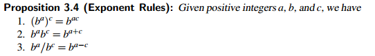
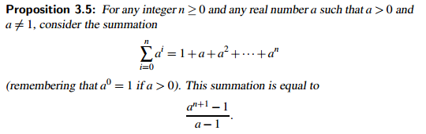
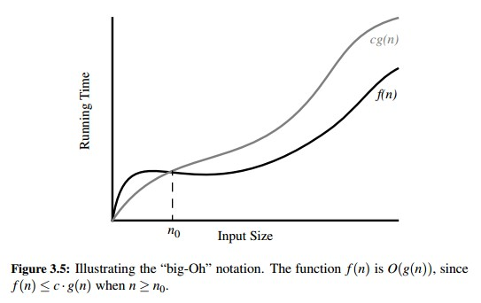
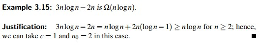
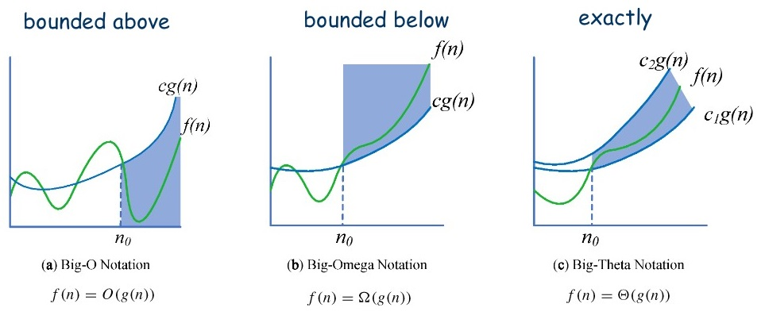
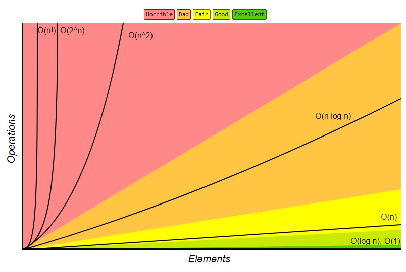

<h1>Algorithm Analysis</h1>


A _data structure_ is a systematic way of organizing and accessing data, and an _algorithm_ is a step-by-step procedure for performing some task in a finite amount of time.

To be able to classify some data structures and algorithms as “good,” we must have precise ways of analyzing them. The primary analysis tool used in this book involves characterizing the running times of algorithms and data structure operations, with space usage also being of interest.

The run time:
- increases with the input size.
- may also vary for different inputs of the same size.
- is affected by the hardware environment (eg: the processor, clock rate, memory, disk).
- is affected by the software environment (eg: the operating system, programming language) in which the algorithm is implemented and executed.
- will be smaller if the computer has a much faster processor
- will be small if the implementation is done in a program compiled into native machine code instead of an interpreted implementation.

In spite of the possible variations that come from different environmental factors, we would like to focus on the relationship between the running time of an algorithm and the size of its input. We are interested in characterizing an algorithm’s running time as a function of the input size.


<h2>Experimental Studies</h2>


We can study the run time of algorithms by executing it on various inputs and recording the time spent during each execution. This can be done in python as below:

```python
from time import time
start time = time( ) # record the starting time
# run algorithm
end time = time( ) # record the ending time
elapsed = end time − start time # compute the elapsed time
```

An elapsed time measured in this fashion is a decent reflection of the algorithm efficiency, but it is by no means perfect. The time function measures relative to what is known as the “wall clock.” Because many processes share use of a computer’s _central processing unit_ (or CPU), the elapsed time will depend on what other processes are running on the computer when the test is performed. A fairer metric is the number of CPU cycles that are used by the algorithm. This can be determined using the clock function of the time module, but even this measure might not be consistent if repeating the identical algorithm on the identical input, and its granularity will depend upon the computer system. Python includes a more advanced module, named timeit, to help automate such evaluations with repetition to account for such variance among trials.

We can also perform independent experiments on many different test inputs of various sizes and visualize the results by plotting the performance of each run of the algorithm:


To be meaningful, this analysis requires that we choose good sample inputs and test enough of them to be able to make sound statistical claims about the algorithm’s running time.

__Challenges of Experimental Analysis__

While experimental studies of running times are valuable, especially when fine-tuning production quality code, there are three major limitations to their use for algorithm analysis:

- Experimental running times of two algorithms are difficult to directly compare unless the experiments are performed in the same hardware and software environments.

- Experiments can be done only on a limited set of test inputs; hence, they leave out the running times of inputs not included in the experiment (and these inputs may be important).

- An algorithm must be fully implemented in order to execute it to study its running time experimentally.


<h3>Moving Beyond Experimental Analysis</h3>

__Counting Primitive Operations:__

To analyze the running time of an algorithm without performing experiments, we perform an analysis directly on a high-level description of the algorithm (either in the form of an actual code fragment, or language-independent pseudo-code). We define a set of _primitive operations_ such as the following:

- Assigning an identifier to an object
- Determining the object associated with an identifier
- Performing an arithmetic operation (for example, adding two numbers)
- Comparing two numbers
- Accessing a single element of a Python list by index
- Calling a function (excluding operations executed within the function)
- Returning from a function.

Instead of trying to determine the specific execution time of each primitive operation, we will simply count how many primitive operations are executed, and use this number _t_ as a measure of the running time of the algorithm. The implicit assumption in this approach is that the running times of different primitive operations will be fairly similar. Thus, the number, t, of primitive operations an algorithm performs will be proportional to the actual running time of that algorithm.

__Measuring Operations as a Function of Input Size:__

To capture the order of growth of an algorithm’s running time, we will associate, with each algorithm, a function $f(n)$ that characterizes the number of primitive operations that are performed as a function of the input size $n$.

__Focusing on the Worst-Case Input:__


An _average case_ analysis usually requires that we calculate expected running times based on a given input distribution, which usually involves sophisticated probability theory. Therefore, we will characterize running times in terms of the _worst case_. Worst case analysis is much easier than average-case analysis, as it requires only the ability to identify the worst-case input, which is often simple.


<h2>The Seven Functions Used in This Book</h2>


<h3>The Constant Function</h3>

The simplest function is the _constant function_,

$$f(n) = c$$

for some fixed constant c, such as c = 5, c = 27, or $c = 2^{10}$. That is, for any argument n, the constant function $f(n)$ assigns the value c. In other words, it does not matter what the value of n is; $f(n)$ will always be equal to the constant value c.

Because we are most interested in integer functions, the most fundamental constant function is $g(n) = 1$ and any other function $f(n) = c$ can be written as $f(n) = cg(n)$.

The constant function characterizes the number of steps needed to do a basic operation on a computer, like adding two numbers, assigning a value to some variable, or comparing two numbers.

<h3>The Logarithm Function</h3>

$f(n) = log_b n$ for some constant _b > 1_. This function is defined as:

$$x = log_bn \ \text{iff} \  b^x = n$$

By definition, $log_b 1 = 0$. The value b is known as the _base_ of the logarithm.


<h3>The Linear Function</h3>

$$f(n) = n$$

This function arises in algorithm analysis any time we have to do a single basic operation for each of n elements. For example, comparing a number x to each element of a sequence of size n will require n comparisons. The linear function also represents the best running time we can hope to achieve for any algorithm that processes each of n objects that are not already in the computer’s memory, because reading in the n objects already requires n operations.

<h3>The N-Log-N Function</h3>

$$f(n) = n log \ n$$

This function grows a little more rapidly than the linear function and a lot less rapidly than the quadratic function; therefore, we would greatly prefer an algorithm with a running time that is proportional to $nlog \ n$, than one with quadratic running time. We will see several important algorithms that exhibit a running time proportional to the n-log-n function. For example, the fastest possible algorithms for sorting n arbitrary values require time proportional to $nlog \ n$.

<h3>The Quadratic Function</h3>

$$f(n) = n^2$$

The main reason why the quadratic function appears in the analysis of algorithms is that there are many algorithms that have nested loops, where the inner loop performs a linear number of operations and the outer loop is performed a linear number of times. Thus, in such cases, the algorithm performs $n \times n = n^2$ operations.

<h3>The Cubic Function and Other Polynomials</h3>

$$f(n) = n^3$$

__Polynomials:__

Most of the functions we have listed so far can each be viewed as being part of a larger class of functions, the _polynomials_. A polynomial function has the form,

$$f(n) = a_0 + a_1n+ a_2n^2 + a_3n^3 + \cdots + a_dn^d$$

where the a's are the constants and _d_ is the _degree_ of the polynomial.

__Summations:__

The above polynomial f(n) can be written as a summation notation:

$$f(n) = \sum_{i=0}^d a_i n^i$$

<h3>The Exponential Function</h3>

$$f(n) = b^n$$



__Geometric Sums:__



Summations as shown in Proposition 3.5 are called _geometric_ summations.

<h3>Comparing Growth Rates</h3>


When discussing logarithms, we noted that the value is generally not an integer, yet the running time of an algorithm is usually expressed by means of an integer quantity, such as the number of operations performed. Thus, the analysis of an algorithm may sometimes involve the use of the _floor function_ and _ceiling function_, which are defined respectively as follows:

- $\lfloor x \rfloor$ = the largest integer less than or equal to x.
- $\lceil x \rceil$ = the smallest integer greater than or equal to x.


<h2>Asymptotic Analysis</h2>


We analyze algorithms using a mathematical notation for functions that disregards constant factors. Namely, we characterize the running times of algorithms by using functions that map the size of the input, n, to values that correspond to the main factor that determines the growth rate in terms of n.


<h3>The “Big-Oh” Notation</h3>

Let $f(n)$ and $g(n)$ be functions mapping positive integers to positive real numbers. We say that $f(n)$ is $O(g(n))$ if there is a real constant $c > 0$ and an integer constant $n_0 \geq 1$ such that

$$f(n) \leq cg(n), \qquad \text{for} \ n \geq n_0$$

This definition is often referred to as the “big-Oh” notation, for it is sometimes pronounced as “ $f(n)$ is big-Oh of $g(n)$.”



The big-Oh notation allows us to say that a function $f(n)$ is “less than or equal to” another function $g(n)$ up to a constant factor and in the asymptotic sense as n grows toward infinity. This ability comes from the fact that the definition uses “$\leq$” to compare $f(n)$ to a $g(n)$ times a constant, c, for the asymptotic cases when $n \geq n_0$. So, it is best to say

"$f(n)$ __is__ $O(g(n))$."

Alternatively, we can say “$f(n)$ is __order of__ $g(n)$.” For the more mathematically inclined, it is also correct to say, “$f(n) \in O(g(n))$,” for the big-Oh notation, technically speaking, denotes a whole collection of functions.

__Characterizing Running Times Using the Big-Oh Notation__

The big-Oh notation is used widely to characterize running times and space bounds in terms of some parameter n, which varies from problem to problem, but is always defined as a chosen measure of the “size” of the problem.

__Some Properties of the Big-Oh Notation__

The big-Oh notation allows us to ignore constant factors and lower-order terms and focus on the main components of a function that affect its growth.


Thus, the highest-degree term in a polynomial is the term that determines the asymptotic growth rate of that polynomial.

We rely on the mathematical fact that $log \ n \leq n \ \text{for} \ n \geq 1$.


__Characterizing Functions in Simplest Terms__

In general, we should use the big-Oh notation to characterize a function as closely as possible. While it is true that the function $f(n) = 4n^3 + 3n^2$ is $O(n^5)$ or even $O(n^4)$, it is more accurate to say that $f(n)$ is $O(n^3)$.

__Big-Omega__

Just as the big-Oh notation provides an asymptotic way of saying that a function is “less than or equal to” another function, the following notations provide an asymptotic way of saying that a function grows at a rate that is “greater than or equal to” that of another.

Let $f(n)$ and $g(n)$ be functions mapping positive integers to positive real numbers. We say that $f(n)$ is $\Omega(g(n))$, pronounced “ $f(n)$ is big-Omega of $g(n)$,” if $g(n)$ is $O(f(n))$, that is, there is a real constant $c > 0$ and an integer constant $n_0 \geq 1$ such that

$$f(n) \geq cg(n), \qquad \text{for} \ n \geq n_0$$

This definition allows us to say asymptotically that one function is greater than or equal to another, up to a constant factor.



__Big-Theta__




For further reference, watch [Asymptotic Bounding 101: Big O, Big Omega, & Theta](https://www.youtube.com/watch?v=0oDAlMwTrLo)

<h3>Comparative Analysis</h3>




Note that the use of the big-Oh and related notations can be somewhat misleading should the constant factors they “hide” be very large. For example, while it is true that the function $10^{100}n$ is $O(n)$, if this is the running time of an algorithm being compared to one whose running time is $10nlogn$, we should prefer the $O(nlogn)$ time algorithm, even though the linear-time algorithm is asymptotically faster.

<h3>Examples of Algorithm Analysis</h3>

__Constant-Time Operations__

In Python list class, a call to the function `len(data)` and accessing elements using `data[j]` for index j are evaluated in constant time, $O(1)$, because the list class maintains an instance variable that records the current length of the list allowing `len` to be reported immediately. Since lists are implemented as _array based sequences_, references to a list's elements are stored in a consecutive block of memory and an element could be accessed using it's index by validating the index, eliminating the need to iterate through the list to get the length or access an element.

__Maximum-Finding Algorithm__

For a maximum finding algorithm, if the list is in a random order with all orders equally likely, the probability that the $j^{th}$ element is the largest of the first $j$ elements is $1/j$ (assuming uniqueness). Hence the expected number of times we update the biggest (including initialization) is $H_n = \sum_{j=1}^n 1/j$, which is known as the $n^{th}$ _Harmonic number_. It turns out that $H_n$ is $O(log \ n)$. Therefore, the expected number of times the biggest value is updated by find max on a randomly ordered sequence is $O(log \ n)$.

__Prefix Averages__

The next problem we consider is computing what are known as _prefix averages_ of a sequence of numbers. Namely, given a sequence S consisting of n numbers, we want to compute a sequence A such that $A[j]$ is the average of elements $S[0], \cdots, S[j], \ \text{for} \ j = 0, \cdots , n−1$, that is,

$$A[j] = \frac{\sum_{i=0}^j S[i]}{j + 1}$$

We analyze three different implementations that solve this problem but with rather different running times.

- 1. A Quadratic-Time Algorithm

```python
def prefix_average1(S):
    """Return list such tha, for all j, A[j] equals average of S[0], ..., S[j]"""
    n = len(S)
    A = [0]*n                       # create new list of n zeros

    for j in range(n):
        total = 0                   # begin computing S[0] + ... + S[j]
        for i in range(j + 1):
            total += S[i]
        A[j] = total / (j + 1)
    return A
```

In the above algorithm:

- `n = len(S)`, executes in constant time.

- `A = [0] * n`,  uses a constant number of primitive operations per element, and thus runs in O(n) time to create and initialize a list with length n with zeros.

- There are two nested for loops, which are controlled, respectively, by counters j and i. The body of the outer loop, controlled by counter j, is executed n times, $\text{for} \ j = 0, \cdots , n−1$. Therefore, statements total = 0 and $A[j] = total / (j+1)$ are executed n times each. This implies that these two statements, plus the management of counter j in the range, contribute a number of primitive operations proportional to n, that is, O(n) time.

- The body of the inner loop, which is controlled by counter i, is executed j+1 times, depending on the current value of the outer loop counter j. Thus, statement `total += S[i]`, in the inner loop, is executed $1 + 2 + 3 + \cdots + n$ times, this $1 + 2 + 3 + \cdots + n = n(n+1)/2$ which implies that the statement in the inner loop contributes $O(n^2)$ time.

Thus the runtime of this algorithm is $O(n^2)$.

- 2.

Second implementation for computing prefix averages:

```python
def prefix_average2(S):
    """Return list such tha, for all j, A[j] equals average of S[0], ..., S[j]"""
    n = len(S)
    A = [0]*n                           # create new list of n zeros

    for j in range(n):
        A[j] = sum(S[0:j+1]) / (j + 1)  # record the average
    return A
```

Asymptotically, this implementation is no better. Even though the expression, `sum(S[0:j+1])`, seems like a single command, it is a function call and an evaluation of that function takes $O(j + 1)$ time in this context. Technically, the computation of the slice, `S[0:j+1]`, also uses $O(j + 1)$ time, as it constructs a new list instance for storage. So the running time of `prefix_average2` is still dominated by a series of steps that take time proportional to 1+2+3+··· +n, and thus $O(n^2)$.

- 3. A Linear-Time Algorithm

Final algorithm, `prefix_averages3`:

```python
def prefix_average3(S):
    """Return list such tha, for all j, A[j] equals average of S[0], ..., S[j]"""
    n = len(S)
    A = [0]*n                           # create new list of n zeros
    total = 0                           # compute prefix sum as S[0] + S[1] + ..

    for j in range(n):
        total += S[j]                   # update prefix sum to include S[j]
        A[j] = total / (j + 1)          # compute average based on current sum
    return A
```

Computing the sum anew for each j value is what led to the quadratic behavior in our previous two algorithms, so here, we calculate the sum dynamically, reducing the run time to $O(n)$

__Three-Way Set Disjointness__

Suppose we are given three sequences of numbers, A, B, and C. We will assume that no individual sequence contains duplicate values, but that there may be some numbers that are in two or three of the sequences. The _three-way set disjointness_ problem is to determine if the intersection of the three sequences is empty, namely, that there is no element x such that $x \in A, x \in B, \ and \ x \in C$.

```python
def disjoint1(A, B, C):
    """Return True if there is no element common to all three lists."""
    for a in A:
        for b in B:
            for c in C:
                if a == b == c:
                    return False
    return True
```

If each of the original sets has size n, then the worst-case running time of this function is $O(n^3)$.

We can improve upon the asymptotic performance with a simple observation. Once inside the body of the loop over B, if selected elements a and b do not match each other, it is a waste of time to iterate through all values of C looking for a matching triple.

```python
def disjoint2(A, B, C):
    """Return True if there is no element common to all three lists."""
    for a in A:
        for b in B:
            if a == b:                  # only check C if we found match from A and B
                for c in C:
                    if a == c:
                        return False
    return True
```

In the improved version, it is not simply that we save time if we get lucky. We claim that the worst-case running time for `disjoint2` is $O(n^2)$. There are quadratically many pairs (a,b) to consider. However, if A and B are each sets of distinct elements, there can be at most $O(n)$ such pairs with a equal to b. Therefore, the innermost loop, over C, executes at most n times.

__Element Uniqueness__

A problem that is closely related to the three-way set disjointness problem is the _element uniqueness problem_. In the former, we are given three collections and we presumed that there were no duplicates within a single collection. In the element uniqueness problem, we are given a single sequence S with n elements and asked whether all elements of that collection are distinct from each other.

```python
def unique1(S):
    """Return True if there are no duplicate elements in sequence S."""
    for j in range(len(S)):
        for k in range(j+1, len(S)):
            if S[j] == S[k]:
                return False
    return True
```

The first iteration of the outer loop causes n−1 iterations of the inner loop, the second iteration of the outer loop causes n−2 iterations of the inner loop, and so on. The worst-case running time of this function is proportional to $(n− 1) + (n− 2) + \cdots + 2 + 1$ which is $O(n^2)$.

__Using Sorting as a Problem-Solving Tool__

An even better algorithm for the element uniqueness problem is based on using sorting as a problem-solving tool. In this case, by sorting the sequence of elements, we are guaranteed that any duplicate elements will be placed next to each other. Thus, to determine if there are any duplicates, all we need to do is perform a single pass over the sorted sequence, looking for consecutive duplicates.

```python
def unique2(S):
    """Return True if there are no duplicate elements in sequence S."""
    temp = sorted(S)                        # create a sorted copy of S
    for j in range(1, len(temp)):
        if S[j-1] == S[j]:
            return False
    return True
```

The built-in function, sorted, produces a copy of the original list with elements in sorted order. It guarantees a worst-case running time of $O(nlog \ n)$. Once the data is sorted, the subsequent loop runs in $O(n)$ time, and so the entire `unique2` algorithm runs in $O(nlog \ n)$ time.


<h2>Simple Justification Techniques</h2>


<h3>By Example</h3>


<h3>The “Contra” Attack</h3>


<h3>Induction and Loop Invariants</h3>


<h2>Exercises</h2>
