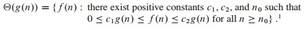
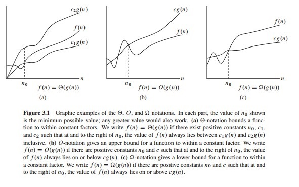

<h1>Lecture 1: Introduction and Peak Finding</h1>

<h2>Peak Finder</h2>

<h3>One-dimensional Version</h3>

__Straightforward Algorithm__

The straightforward algorithm is where you iterate through all the numbers and find the peak, that takes O(n) time. A better way would be to use the divide and conquer approach.

<h3>Two-dimensional Version</h3>

__Attempt # 1: Extend 1D Divide and Conquer to 2D__

Attempt #1 fails because the 2D-peak may not exist on row i.

__Attempt # 2__

<h1>Readings</h1>

<h2>Chapter 1: The Role of Algorithms in Computing</h2>

<h3>Algorithms</h3>

- Informally, an algorithm is any well-defined computational procedure that takes some value, or set of values, as input and produces some value, or set of values, as output. An algorithm is thus a sequence of computational steps that transform the input into the output.

- An _instance of a problem_ consists of the input (satisfying whatever constraints are imposed in the problem statement) needed to compute a solution to the problem.

- Although no efficient algorithm for an NP-complete problem has ever been found, nobody has ever proven that an efficient algorithm for one cannot exist. In other words, no one knows
whether or not efficient algorithms exist for NP-complete problems. Second, the
set of NP-complete problems has the remarkable property that if an efficient algorithm exists for any one of them, then efficient algorithms exist for all of them.

<h2>Chapter 3: Growth of Functions</h2>

When we look at input sizes large enough to make only the order of growth of the running time relevant, we are studying the _asymptotic_ efficiency of algorithms.

<h3>Asymptotic notation</h3>

The notations we use to describe the asymptotic running time of an algorithm are defined in terms of functions whose domains are the set of natural numbers (0, 1, 2, ...). Such notations are convenient for describing the worst-case running-time function T(n), which usually is defined only on integer input sizes.

In this book, the functions to which we apply asymptotic notation will usually characterize the running times of algorithms. But asymptotic notation can apply to functions that characterize some other aspect of algorithms (the amount of space they use, for example), or even to functions that have nothing whatsoever to do with algorithms.

__$\Theta$-notation__

The worst-case running time of insertion sort is $T(n) = \Theta (n^2)$. Let us define what this notation means. For a given function g(n) we denote by $\Theta (g(n))$ the set of functions:

For all $n \geq n_0$, the function f(n) is equal to g(n) to within a constant factor. We say that g(n) is an _asymptotically tight bound_ for f(n).

The definition of $Θ(g(n))$ requires that every member $f(n)=Θ(g(n))$ be _asymptotically nonnegative_, that is, that f(n) be nonnegative whenever n is sufficiently large.

<h2>Chapter D.1: Matrices and matrix operations</h2>
