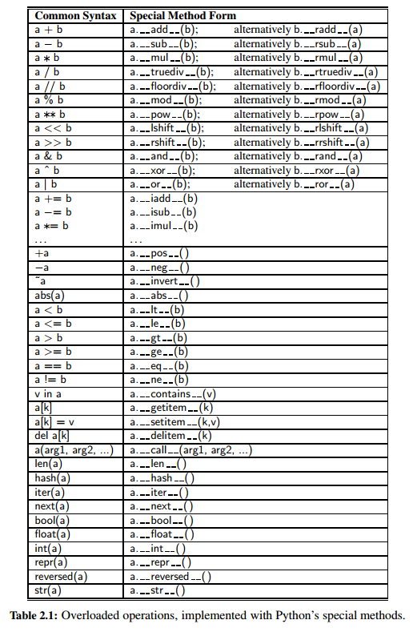
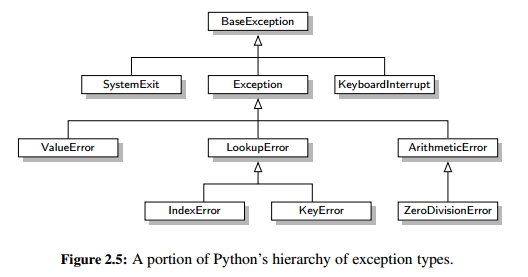
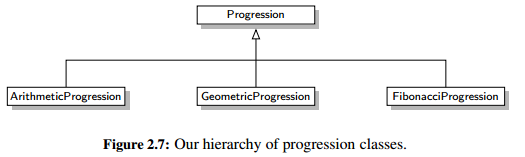

<h1>Object Oriented Programming</h1>

<h2>Goals, Principles, and Patterns</h2>

In object-oriented paradigm each __object__ is an _instance_ of a _class_. Each class presents to the outside world a concise and consistent view of the objects that are instances of this class, without going into too much unnecessary detail or giving others access to the inner workings of the objects. The class definition typically specifies _instance variables_ also known as _data members_ that the object contains, as well as the _methods_ also known as _member functions_ that the object can execute. This view of computing is intended to fulfill several goals and incorporate several design principles.

<h3>Object-Oriented Design Goals</h3>

Software implementations should achieve _robustness_, _adaptability_, and _reusability_.

<h3>Object-Oriented Design Principles</h3>

Chief among the principles of the object-oriented approach, which are intended to facilitate the goals outlined above, are the following:

- __Modularity__: refers to an organizing principle in which different components of a software system are divided into separate functional units.

- __Abstraction__: is to distill a complicated system down to its most fundamental parts. Applying the abstraction paradigm to the design of data structures gives rise to _abstract data types_ (ADTs). An ADT is a mathematical model of a data structure that specifies the type of data stored, the operations supported on them, and the types of parameters of the operations. An ADT specifies what each operation does, but not how it does it. We will typically refer to the collective set of behaviors supported by an ADT as its public interface.

    Python supports abstract data types using a mechanism known as an _abstract base class_ (ABC). An abstract base class cannot be instantiated (i.e., you cannot directly create an instance of that class), but it defines one or more common methods that all implementations of the abstraction must have. An ABC is realized by one or more concrete classes that inherit from the abstract base class while providing implementations for those method declared by the ABC.

- __Encapsulation__: yields robustness and adaptability, for it allows the implementation details of parts of a program to change without adversely affecting other parts, thereby making it easier to fix bugs or add new functionality with relatively local changes to a component.

<h3>Design Patterns</h3>

_Design pattern_ describes a solution to a “typical” software design problem. A pattern provides a general template for a solution that can be applied in many different situations. It describes the main elements of a solution in an abstract way that can be specialized for a specific problem at hand. It consists of a name, which identifies the pattern; a context, which describes the scenarios for which this pattern can be applied; a template, which describes how the pattern is applied; and a result, which describes and analyzes what the pattern produces.

<h2>Software Development</h2>

Traditional software development involves several phases. Three major steps are:
1. Design
2. Implementation
3. Testing and Debugging

<h3>Design</h3>

While general prescriptions are hard to come by, there are some rules of thumb that we can apply when determining how to design our classes:

- __Responsibilities__: Divide the work into different actors, each with a different responsibility. Try to describe responsibilities using action verbs. These actors will form the classes for the program.

- __Independence__: Define the work for each class to be as independent from other classes as possible. Subdivide responsibilities between classes so that each class has autonomy over some aspect of the program. Give data (as instance variables) to the class that has jurisdiction over the actions that require access to this data.

- __Behaviors__: Define the behaviors for each class carefully and precisely, so that the consequences of each action performed by a class will be well understood by other classes that interact with it. These behaviors will define the methods that this class performs, and the set of behaviors for a class are the interface to the class, as these form the means for other pieces of code to interact with objects from the class.

Defining the classes, together with their instance variables and methods, are key to the design of an object-oriented program. A common tool for developing an initial high-level design for a project is the use of _CRC_ (Class-Responsibility-Collaborator) cards. The main idea behind this tool is to have each card represent a component, which will ultimately become a class in the program, write the responsibilities of the class and list the collaborators for this component.

The design process iterates through an action/actor cycle, where we first identify an action (that is, a responsibility), and we then determine an actor (that is, a component) that is best suited to perform that action.

As the design takes form, a standard approach to explain and document the design is the use of _UML_ (Unified Modeling Language) diagrams to express the organization of a program. One type of UML figure is known as a class diagram. An example of such a diagram is shown below:

<h3>Pseudo-Code</h3>

As an intermediate step before the implementation of a design, programmers are often asked to describe algorithms in a way that is intended for human eyes only. Such descriptions are called _pseudo-code_.

<h3>Coding Style and Documentation</h3>

[Style Guide for Python Code](https://www.python.org/dev/peps/pep-0008/)

Python provides integrated support for embedding formal documentation directly in source code using a mechanism known as a _docstring_. Formally, any string literal that appears as the first statement within the body of a module, class, or function (including a member function of a class) will be considered to be a docstring.

A docstring is stored as a field of the module, function, or class in which it is declared. It serves as documentation and can be retrieved in a variety of ways. An external tool named pydoc is distributed with Python and can be used to generate formal documentation as text or as a Web page. Guidelines for authoring useful docstrings are available at [PEP 257](https://www.python.org/dev/peps/pep-0257/)

<h3>Testing and Debugging</h3>

Testing is the process of experimentally checking the correctness of a program, while debugging is the process of tracking the execution of a program and discovering the errors in it.

__Testing:__

Testing every method of a class atleast once - method coverage.
Testing each code statement in the program atleast once - statement coverage.

There are two main testing strategies, _top-down_ and _bottom-up_, which differ in the order in which components are tested. Top-down testing proceeds from the top to the bottom of the program hierarchy. It is typically used in conjunction with _stubbing_, a boot-strapping technique that replaces a lower-level component with a stub, a replacement for the component that simulates the functionality of the original. For example, if function A calls function B to get the first line of a file, when testing A we can replace B with a stub that returns a fixed string. Bottom-up testing proceeds from lower-level components to higher-level components.

As software is maintained, the act of _regression testing_ is used, whereby all previous tests are re-executed to ensure that changes to the software do not introduce new bugs in previously tested components.

__Debugging:__

The simplest debugging technique consists of using print statements to track the values of variables during the execution of the program. A better approach is to run the program within a _debugger_, which is a specialized environment for controlling and monitoring the execution of a program. The standard Python distribution includes a module named pdb, which provides debugging support directly within the interpreter.

<h2>Class Definitions</h2>

A class also serves as a blueprint for its instances, effectively determining the way that state information for each instance is represented in the form of _attributes_ (also known as _fields_, _instance variables_, or _data members_).

<h3>Example: CreditCard Class</h3>

__The self Identifier:__

In Python, the self identifier plays a key role. _self_ serves to identify the particular instance upon which a member is invoked.

__The Constructor:__

The specially named `__init__` method that serves as the _constructor_ of a class. Its primary responsibility is to establish the state of a newly created object with appropriate instance variables.

<h3>Operator Overloading and Python’s Special Methods</h3>

__operator overloading_ is done by implementing a specially named method. For example, the `+` operator is overloaded by implementing a method named `__add__`, which takes the right-hand operand as a parameter and which returns the result of the expression. That is, the syntax, a + b, is converted to a method call on object a of the form, `a.__add__(b)`. Similar specially named methods exist for other operators.

<h3>Iterators</h3>

An _iterator_ for a collection provides one key behavior: It supports a special method named `__next__` that returns the next element of the collection, if any, or raises a StopIteration exception to indicate that there are no further elements.

Fortunately, it is rare to have to directly implement an iterator class. Our preferred approach is the use of the _generator_ syntax, which automatically produces an iterator of yielded values.

<h2>Inheritance</h2>

A natural way to organize various structural components of a software package is in a hierarchical fashion, with similar abstract definitions grouped together in a level-by-level manner that goes from specific to more general as one traverses up the hierarchy. For example below is a hierarchy of various exception types in python.

A hierarchical design is useful in software development, as common functionality can be grouped at the most general level, thereby promoting reuse of code, while differentiated behaviors can be viewed as extensions of the general case, In object-oriented programming, the mechanism for a modular and hierarchical organization is a technique known as _inheritance_. This allows a new class to be defined based upon an existing class as the starting point. In object-oriented terminology, the existing class is typically described as the _base class_, _parent class_, or _superclass_, while the newly defined class is known as the _subclass_ or _child class_.

There are two ways in which a subclass can differentiate itself from its superclass. A subclass may _specialize_ an existing behavior by providing a new implementation that _overrides_ an existing method. A subclass may also _extend_ its superclass by providing brand new methods.

<h3>Extending the CreditCard Class</h3>

The mechanism for calling the inherited constructor relies on the syntax, `super()`. For example, for the above uml diagram `super().__init__(customer, bank, acnt, limit)`.

__Protected Members:__

Several object-oriented languages (e.g., Java, C++) draw a distinction for nonpublic members, allowing declarations of _protected_ or _private_ access modes. Members that are declared as protected are accessible to subclasses, but not to the general public, while members that are declared as private are not accessible to either. Python does not support formal access control, but names beginning with a single underscore are conventionally akin to protected, while names beginning with a double underscore (other than special methods) are akin to private.

<h3>Hierarchy of Numeric Progressions</h3>

As a second example of the use of inheritance, we develop a hierarchy of classes for iterating numeric progressions. For example when you have arithmetic, geometric and fibonacci progression:

<h3>Abstract Base Classes</h3>

In classic object-oriented terminology, we say a class is an _abstract base class_ if its only purpose is to serve as a base class through inheritance. More formally, an abstract base class is one that cannot be directly instantiated, while a concrete class is one that can be instantiated.

In statically typed languages such as Java and C++, an abstract base class serves as a formal type that may guarantee one or more _abstract methods_. This provides support for polymorphism, as a variable may have an abstract base class as its declared type, even though it refers to an instance of a concrete subclass. Because there are no declared types in Python, this kind of polymorphism can be accomplished without the need for a unifying abstract base class. For this reason, there is not as strong a tradition of defining abstract base classes in Python, although Python’s abc module provides support for defining a formal abstract base class.

The _template method pattern_ is when an abstract base class provides concrete behaviors that rely upon calls to other abstract behaviors. In that way, as soon as a subclass provides definitions for the missing abstract behaviors, the inherited concrete behaviors are well defined.

A _metaclass_ is different from a superclass, in that it provides a template for the class definition itself. Specifically, the ABCMeta declaration assures that the constructor for the class raises an error.

The `@abstractmethod` decorator declares particular methods to be abstract, meaning that we do not provide an implementation within our Sequence base class, but that we expect any concrete subclasses to support those two methods. Python enforces this expectation, by disallowing instantiation for any subclass that does not override the abstract methods with concrete implementations.

<h2>Namespaces and Object-Orientation</h2>

A namespace is an abstraction that manages all of the identifiers that are defined in a particular scope, mapping each name to its associated value.

<h3>Instance and Class Namespaces</h3>

_Instance namespace_ manages attributes specific to an individual object. _Class namespace_ manages members that are to be shared by all instances of a class, or used without reference to any particular instance.

A _class-level data member_ is often used when there is some value, such as a constant, that is to be shared by all instances of a class.

__Dictionaries and the slots Declaration:__

By default, Python represents each namespace with an instance of the built-in dict class that maps identifying names in that scope to the associated objects. While a dictionary structure supports relatively efficient name lookups, it requires additional memory usage beyond the raw data that it stores.

Python provides a more direct mechanism for representing instance namespaces that avoids the use of an auxiliary dictionary. To use the streamlined representation for all instances of a class, that class definition must provide a class-level member named `__slots__` that is assigned to a fixed sequence of strings that serve as names for instance variables.

<h3>Name Resolution and Dynamic Dispatch</h3>

In traditional object-oriented terminology, Python uses what is known as _dynamic dispatch_ (or _dynamic binding_) to determine, at run-time, which implementation of a function to call based upon the type of the object upon which it is invoked. This is in contrast to some languages that use _static dispatching_, making a compile-time decision as to which version of a function to call, based upon the declared type of a variable.

<h2>Shallow and Deep Copying</h2>

A _shallow copy_ means constructing a new collection object and then populating it with references to the child objects found in the original. The copying process does not recurse and therefore won’t create copies of the child objects themselves. In case of shallow copy, a reference of object is copied in other object. It means that any changes made to a copy of object do reflect in the original object. In python, this is implemented using “copy()” function.

_Deep copy_ is a process in which the copying process occurs recursively. It means first constructing a new collection object and then recursively populating it with copies of the child objects found in the original. In case of deep copy, a copy of object is copied in other object. It means that any changes made to a copy of object do not reflect in the original object. In python, this is implemented using “deepcopy()” function.

<h2>Exercises</h2>

<h3>Reinforcement</h3>

R-2.4 Write a Python class, Flower, that has three instance variables of type str, int, and float, that respectively represent the name of the flower, its number of petals, and its price. Your class must include a constructor method that initializes each variable to an appropriate value, and your class should include methods for setting the value of each type, and retrieving the value of each type.

R-2.6 If the parameter to the make payment method of the CreditCard class were a negative number, that would have the effect of raising the balance on the account. Revise the implementation so that it raises a ValueError if a negative value is sent.

R-2.9 Implement the __sub__ method for the Vector class of Section 2.3.3, so that the expression u−v returns a new vector instance representing the difference between two vectors.

R-2.10 Implement the __neg__ method for the Vector class of Section 2.3.3, so that the expression −v returns a new vector instance whose coordinates are all the negated values of the respective coordinates of v.

R-2.11 In Section 2.3.3, we note that our Vector class supports a syntax such as v = u + [5, 3, 10, −2, 1], in which the sum of a vector and list returns a new vector. However, the syntax v = [5, 3, 10, −2, 1] + u is illegal. Explain how the Vector class definition can be revised so that this syntax
generates a new vector.

R-2.12 Implement the __mul__ method for the Vector class of Section 2.3.3, so that the expression v 3 returns a new vector with coordinates that are 3 times the respective coordinates of v.

R-2.13 Exercise R-2.12 asks for an implementation of __mul__, for the Vector class of Section 2.3.3, to provide support for the syntax v 3. Implement the __rmul__ method, to provide additional support for syntax 3 v.

R-2.14 Implement the __mul__ method for the Vector class of Section 2.3.3, so that the expression u v returns a scalar that represents the dot product of the vectors.

<h3>Creativity</h3>

C-2.31 Write a Python class that extends the Progression class so that each value in the progression is the absolute value of the difference between the previous two values. You should include a constructor that accepts a pair of numbers as the first two values, using 2 and 200 as the defaults.

C-2.32 Write a Python class that extends the Progression class so that each value in the progression is the square root of the previous value. (Note that you can no longer represent each value with an integer.) Your constructor should accept an optional parameter specifying the start value, using 65,536 as a default.

<h3>Projects</h3>

P-2.35 Write a set of Python classes that can simulate an Internet application in which one party, Alice, is periodically creating a set of packets that she wants to send to Bob. An Internet process is continually checking if Alice has any packets to send, and if so, it delivers them to Bob’s computer, and Bob is periodically checking if his computer has a packet from Alice, and, if so, he reads and deletes it.

P-2.38 Write a Python program that simulates a system that supports the functions of an e-book reader. You should include methods for users of your system to “buy” new books, view their list of purchased books, and read their purchased books. Your system should use actual books, which have expired copyrights and are available on the Internet, to populate your set of available books for users of your system to “purchase” and read

P-2.39 Develop an inheritance hierarchy based upon a Polygon class that has abstract methods area() and perimeter(). Implement classes Triangle, Quadrilateral, Pentagon, Hexagon, and Octagon that extend this base class, with the obvious meanings for the area() and perimeter() methods. Also implement classes, IsoscelesTriangle, EquilateralTriangle, Rectangle, and Square, that have the appropriate inheritance relationships. Finally, write a simple program that allows users to create polygons of the various types and input their geometric dimensions, and the program then outputs their area and perimeter. For extra effort, allow users to input polygons by specifying their vertex coordinates and be able to test if two such polygons are similar.
