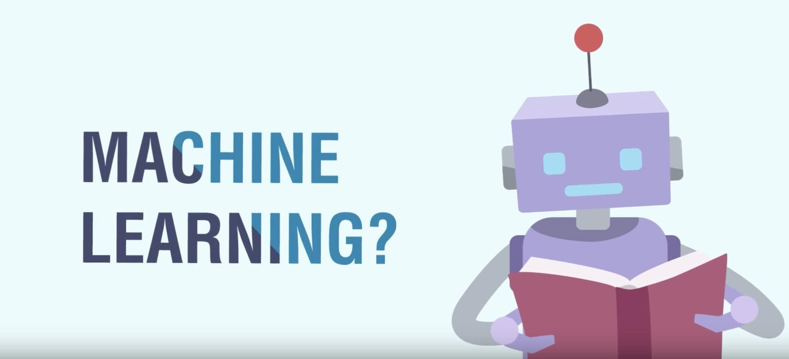

<h1 id="HackerRankSolutions" align="center" >Learn Machine Learning in 6 Months</h1>

<h2>Introduction</h2>

To be a good Machine Learning Engineer, you should not only know about Machine Learning, you should also have a good understanding about Data Science, some programming languages, software fundamentals and Big Data because the job of a Machine Learning engineer is somewhere in-between a Data Scientist and a Software Engineer and they usually act like a bridge for these two fields, so knowing some fundamentals in both of these fields will help you immensely.

I put together this repo for anyone wanting to become a good Machine Learning Engineer and all these courses are from [Coursera](https://www.coursera.org/). To get access to the quiz you have to get the paid version but if you can't pay for it, they also offer financial aid but you will have to wait 15 days to get approved but it will be worth the wait if you can't pay.

Also, a word of warning, this is a pretty intense compilation of courses, the math is intense, the topics are complex, you will learn five programming languages, Python, C, C++, Java and SQL and to be good, you have to practice, I recommend HackerRank and I have also created a repository with all my [HackerRank solutions](https://github.com/mukeshmithrakumar/HackerRankSolutions).

The Math side, again, practice, finishing it in 6 months should not be your goal, even though it is an important one, understanding all the topics should be, so practice as much as you can. Even though I have provided all the quiz solutions, don't look into it till you finish or get stuck or are really confused. Your goal I assume is to get a job and remember, no one will give you a job for finishing these courses, you will have to know to apply, so make sure you do.

Next, this is a full time course plan, if you are in college, plan to go through this during your breaks, summer or winter but if you are working, it will take you more than 6 months to finish so spread it out. I work full time, and I also mentor, but I found time to squeeze these courses, so if you are committed, you should be able to as well. Good Luck 🙂.

Finally, I am personally taking all these courses so I know for a fact how affective they are and how good, so if you are going through some sections and if you have any doubts, feel free to reach out, or if you just wanna say hi, would be more than glad to help you:

I also have a blog for anyone interested in learning Artificial Intelligence, Machine Learning and Deep Learning Topics:

<h2>Study Plan</h2>

Following is the list of courses we will be taking. The first 3 months you will focus on the courses under Phase 1 and the next 3 months, you should focus on the courses in Phase 2. In between to reinforce some concepts and refresh some fundamentals, we will also go through other video lectures online and I will provide links to it on my course notes README. After every month, we should take a week to review everything we studied to reinforce the concepts

<h3>Phase 1:</h3>

1. [IBM Data Science Professional Certificate](https://www.coursera.org/professional-certificates/ibm-data-science)
2. [Introduction to Programming in C Specialization](https://www.coursera.org/specializations/c-programming)
3. [Mathematics for Machine Learning Specialization](https://www.coursera.org/specializations/mathematics-machine-learning)
4. [Software Development Life-cycle Specialization (Continue in Phase 2)](https://www.coursera.org/specializations/software-development-lifecycle)
5. [Software Design and Architecture Specialization (Continue in Phase 2)](https://www.coursera.org/specializations/software-design-architecture)
6. [Big Data Specialization](https://www.coursera.org/specializations/big-data)
7. [IBM Applied AI Professional Certificate](https://www.coursera.org/professional-certificates/applied-artifical-intelligence-ibm-watson-ai)

<h3>Phase 2:</h3>

8. [Advanced Data Science with IBM Specialization](https://www.coursera.org/specializations/advanced-data-science-ibm)
9. [Accelerated Computer Science Fundamentals Specialization](https://www.coursera.org/specializations/cs-fundamentals)
10. [C++ For C Programmers Part A](https://www.coursera.org/learn/c-plus-plus-a)
11. [C++ For C Programmers Part B](https://www.coursera.org/learn/c-plus-plus-b)
12. [Advanced Machine Learning Specialization](https://www.coursera.org/specializations/aml)
13. [Probabilistic Graphical Models Specialization](https://www.coursera.org/specializations/probabilistic-graphical-models)
14. [IBM AI Engineering Professional Certificate](https://www.coursera.org/professional-certificates/ai-engineer?)

In this repository you will find the solution to all the quizzes, code and also my short notes for all the courses.

<h3>Time Table</h3>

You should roughly plan to spend around:
- 2hrs everyday from Monday to Friday for Data Science
- 2hrs everyday from Monday to Friday for C and C++
- 2hrs everyday from Monday to Saturday for Machine Learning
- 1hr everyday from Monday to Saturday for Software Engineering
- 1hr everyday from Monday to Saturday for Big Data
- On Saturdays you can spend up-to 4 hours studying for the IBM AI Professional Certificate

<h3>What would you have learned</h3>

By the End of the courses you would have learned:

- Programming Languages:
    - Python,
    - Java,
    - C,
    - C++,
    - SQL

- Database Management System:
    - IBM Db2 Warehouse

- Big Data Management System:
    - Hadoop
    - MapReduce
    - MongoDB
    - Aerospike
    - Spark
    - Splunk
    - Postgres

- Machine Learning Frameworks:
    - Spark MLlib

- Cloud Services:
    - IBM Cloud,
    - IBM Watson

- Software Skills:
    - Lean Development
    - Agile Development

<h2>Review</h2>

Below you can see my progress each month, reviewing everything we went through for a month in a week is not possible because I also use this time to do a lot of extra reading and coding, so below you will see under completed, the courses that I finished and was able to review and under not completed the courses I finished but was not able to complete and I will come back to review these courses in the following months' review day.

<h3>1st Month Review</h3>

<h4>Completed Courses</h4>

- IBM Data Science:
    - What is Data Science?
    - Open Source tools for Data Science
    - Data Science Methodology
    - Python for Data Science and AI

- Introduction to Programming in C
    - Programming Fundamentals
    - Writing, Running, and Fixing Code in C

- Mathematics for Machine Learning
    - Linear Algebra
    - Multivariate Calculus

- Software Development Life-cycle
    - Software Development Processes and Methodologies

- Big Data
    - Introduction to Big Data
    - Big Data Modeling and Management Systems

- IBM Applied AI Professional
    - Introduction to Artificial Intelligence

<h4>Completed Review</h4>

- IBM Data Science:
    - What is Data Science?
    - Open Source tools for Data Science
    - Data Science Methodology
    - Python for Data Science and AI

- Introduction to Programming in C
    - Programming Fundamentals

- Mathematics for Machine Learning
    - Linear Algebra (50%)
    - Multivariate Calculus (50%)

- Software Development Life-cycle
    - Software Development Processes and Methodologies

- Big Data
    - Introduction to Big Data

- IBM Applied AI Professional
    - Introduction to Artificial Intelligence

<h4>Not Completed Review</h4>

- Introduction to Programming in C
    - Writing, Running, and Fixing Code in C

- Mathematics for Machine Learning
    - Linear Algebra (50%)
    - Multivariate Calculus (50%)

- Big Data
    - Big Data Modeling and Management Systems

<h3>2nd Month Review:</h3>

<h4>Completed Courses</h4>

- Software Design and Architecture
    - Object-Oriented Design

<h4>Completed Review</h4>

<h4>Not Completed Review</h4>
